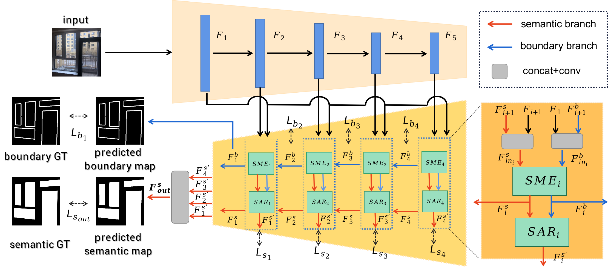

# RFENet
This repo contains the the implementation of Our IJCAI-2023 work: RFENet: Towards Reciprocal Feature Evolution for Glass Segmentation.

[paper](https://www.ijcai.org/proceedings/2023/0080.pdf)

[arxiv](https://arxiv.org/abs/2307.06099)

Any Suggestions/Questions/Pull Requests are welcome.
  



The master branch works with PyTorch 1.10.1 .


# Dataset Preparation
Dataloaders for Trans10k, PMD, and GSD are available in [datasets](./datasets). 
Details of preparing each dataset can be found at [DATASETS.md](./DATASETS.md)


# Model Checkpoint

## Pretrained Backbones

The pretrained backbones we use is the same as that used in the [EBLNet](https://openaccess.thecvf.com/content/ICCV2021/html/He_Enhanced_Boundary_Learning_for_Glass-Like_Object_Segmentation_ICCV_2021_paper.html) paper, which you can find in the README file of [EBLNet](https://openaccess.thecvf.com/content/ICCV2021/html/He_Enhanced_Boundary_Learning_for_Glass-Like_Object_Segmentation_ICCV_2021_paper.html).

## Trained Models and CKPTs

Here are the trained models reported in our paper, you can use them to evaluate.

<table><thead><tr><th>Dataset</th><th>Backbone</th><th>mIoU</th><th>Model</th></tr></thead><tbody>
<tr><td>Trans10k</td><td>ResNet50 (os8)</td><td>91.25</td><td><a href="https://drive.google.com/file/d/1yN1iWMs-FNdQI_rVP5w82GYgDX73Bl5a/view?usp=drive_link" target="_blank" rel="noopener noreferrer">Link</a></td></tr>
<tr><td>GSD</td><td>ResNeXt101</td><td>86.50</td><td><a href="https://drive.google.com/file/d/1b7V3qdiBY6_9614tLVb9lysflr5iNtPi/view?usp=drive_link" rel="noopener noreferrer">Link</a></td></tr>
<tr><td>PMD</td><td>ResNeXt101</td><td>73.56</td><td><a href="https://drive.google.com/file/d/1ACiP4i7iBxC7XVQ5vOuroGZqk4mCiS94/view?usp=drive_lin" rel="noopener noreferrer">Link</a></td></tr>

</tbody></table>


## Evaluation
After downloading the trained models, you could easily evaluate the models with the scripts located in *scripts/test* directory. For example, when evaluating the RFENet on Trans10k dataset:
```bash
sh scripts/test/test_Trans10k_R50_os8_RFENet.sh {path_of_checkpoint} {path_to_save_results}
```
Note that, when computing the mean IoU, we **do not** include the background.

During evaluation, if you don't want to save images during evaluating for visualization, all you need to do is remove args: `dump_images` in the test scripts.

## Training
You could easily evaluate the models with the scripts located in *scripts/train* directory. For example, when training RFENet on the Trans10k dataset:
```bash
sh scripts/train/train_Trans10k_R50_os8_RFENet.sh {path_to_save_results}
```
Note that, all our models are trained on 4 V-100 GPUs with 32G memory.

## Citation
If you find this repo is helpful to your research. Please consider cite our work.
```
@inproceedings{DBLP:conf/ijcai/FanWWWYM23,
  author       = {Ke Fan and
                  Changan Wang and
                  Yabiao Wang and
                  Chengjie Wang and
                  Ran Yi and
                  Lizhuang Ma},
  title        = {RFENet: Towards Reciprocal Feature Evolution for Glass Segmentation},
  booktitle    = {Proceedings of the Thirty-Second International Joint Conference on
                  Artificial Intelligence, {IJCAI} 2023, 19th-25th August 2023, Macao,
                  SAR, China},
  pages        = {717--725},
  publisher    = {ijcai.org},
  year         = {2023},
  url          = {https://doi.org/10.24963/ijcai.2023/80},
  doi          = {10.24963/ijcai.2023/80},
  timestamp    = {Mon, 28 Aug 2023 17:23:07 +0200},
  biburl       = {https://dblp.org/rec/conf/ijcai/FanWWWYM23.bib},
  bibsource    = {dblp computer science bibliography, https://dblp.org}
}
```


# Acknowledgement
This repo is based on EBLNet [repo](https://github.com/hehao13/EBLNet) and NVIDIA segmentation [repo](https://github.com/NVIDIA/semantic-segmentation).
We fully thank their open-sourced code.